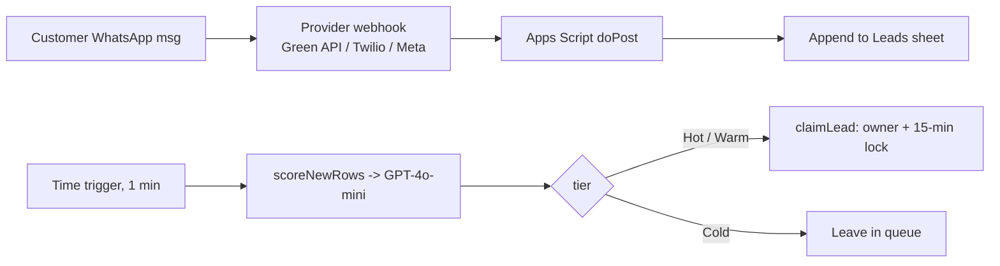

Last month a client's two sales reps both spent an hour chasing the same WhatsApp lead. Neither closed it — the customer felt double-teamed and went quiet. Their "system" was one shared WhatsApp login and a lot of hope.

I rebuilt it as a Google Sheets sales inbox: every WhatsApp message lands in a sheet, gets an AI buying-intent score, and gets locked to one rep for 15 minutes. This post is the whole build, with the code — about 80 lines of Apps Script you can copy and adapt.

## Why the shared-inbox approach breaks

A shared WhatsApp number is fine until two people open it at once. There's no record of who's handling what, no way to see which leads are actually hot, and no lock to stop two reps replying to the same person. The usual fix — a $150/user/month CRM with a WhatsApp add-on — is overkill for a 3-person team and still doesn't score intent out of the box.

You already have a shared database your team knows: a Google Sheet. Apps Script can be the backend. We need exactly three pieces — a webhook to catch messages, an LLM call to score them, and a lock to assign them.



Set up a sheet named `Leads` with these columns, then add this constant so the code and the sheet agree:

```javascript
// Leads columns: timestamp | msgId | from | name | text | score | tier | owner | lockedAt
const COL = { TS:1, MSG_ID:2, FROM:3, NAME:4, TEXT:5, SCORE:6, TIER:7, OWNER:8, LOCKED_AT:9 };
```

## 1\. Catch the message: the webhook

Deploy this as a Web App (Deploy → New deployment → Web app, *Execute as: Me*, *Who has access: Anyone*), then paste the deployment URL into your WhatsApp provider's webhook setting. The `doPost` runs on every inbound message.

```javascript
function doPost(e) {
  try {
    const body = JSON.parse(e.postData.contents);
    const msg = extractMessage(body);
    if (!msg) return json({ status: 'ignored' });

    const sheet = SpreadsheetApp.getActiveSpreadsheet().getSheetByName('Leads');

    // Providers occasionally resend the same message — dedupe by id.
    const seen = sheet.getRange(2, COL.MSG_ID, Math.max(sheet.getLastRow() - 1, 1), 1)
                      .getValues().flat();
    if (seen.indexOf(msg.id) !== -1) return json({ status: 'duplicate' });

    sheet.appendRow([new Date(), msg.id, msg.from, msg.name, msg.text, '', '', '', '']);
    return json({ status: 'logged' });
  } catch (err) {
    return json({ status: 'error', message: err.toString() });
  }
}

function extractMessage(body) {
  // Green API "incomingMessageReceived" shape. Twilio and Meta Cloud send a
  // different payload — you only rewrite THIS function to switch providers.
  if (body.typeWebhook !== 'incomingMessageReceived') return null;
  const md = body.messageData || {};
  const text = (md.textMessageData && md.textMessageData.textMessage) ||
               (md.extendedTextMessageData && md.extendedTextMessageData.text) || '';
  if (!text) return null;
  return {
    id:   body.idMessage,
    from: (body.senderData && body.senderData.sender) || '',
    name: (body.senderData && body.senderData.senderName) || '',
    text: text
  };
}

function json(obj) {
  return ContentService.createTextOutput(JSON.stringify(obj))
    .setMimeType(ContentService.MimeType.JSON);
}
```

The webhook only logs — it stays fast and returns a `200` immediately. Scoring happens separately, which matters because of the execution limit I'll cover in the pitfalls.

## 2\. Score buying intent with GPT-4o-mini

Add a time-driven trigger (Triggers → Add trigger → `scoreNewRows`, time-driven, every minute). It finds rows that haven't been scored yet and rates each one.

```javascript
function scoreNewRows() {
  const sheet = SpreadsheetApp.getActiveSpreadsheet().getSheetByName('Leads');
  const last = sheet.getLastRow();
  if (last < 2) return;

  const rows = sheet.getRange(2, 1, last - 1, COL.LOCKED_AT).getValues();
  rows.forEach((row, i) => {
    if (row[COL.SCORE - 1] !== '') return;         // already scored
    const { score, tier } = scoreLead(row[COL.TEXT - 1]);
    const r = i + 2;
    sheet.getRange(r, COL.SCORE).setValue(score);
    sheet.getRange(r, COL.TIER).setValue(tier);
  });
}

function scoreLead(messageText) {
  const apiKey = PropertiesService.getScriptProperties().getProperty('OPENAI_API_KEY');
  const res = UrlFetchApp.fetch('https://api.openai.com/v1/chat/completions', {
    method: 'post',
    contentType: 'application/json',
    headers: { Authorization: 'Bearer ' + apiKey },
    muteHttpExceptions: true,
    payload: JSON.stringify({
      model: 'gpt-4o-mini',
      temperature: 0,
      response_format: { type: 'json_object' },   // forces valid JSON back
      messages: [{
        role: 'user',
        content: 'Rate this WhatsApp sales inquiry 1-100 for buying intent. ' +
                 'Reply ONLY as JSON {"score": <1-100>, "reason": "<max 8 words>"}. ' +
                 'Message: ' + messageText
      }]
    })
  });
  if (res.getResponseCode() !== 200) return { score: 0, tier: 'Unknown' };
  const out = JSON.parse(JSON.parse(res.getContentText()).choices[0].message.content);
  return { score: out.score, tier: tierFor(out.score) };
}

function tierFor(score) {
  if (score >= 80) return 'Hot';
  if (score >= 50) return 'Warm';
  if (score >= 20) return 'Cold';
  return 'Not a Lead';
}
```

Store your key once with `PropertiesService.getScriptProperties().setProperty('OPENAI_API_KEY', 'sk-...')` — never hard-code it. On `gpt-4o-mini` each score costs roughly $0.0001–0.001 depending on message length, so a few thousand messages a month is a couple of dollars. `response_format: json_object` is the part that makes parsing reliable; without it the model occasionally wraps the JSON in prose and `JSON.parse` throws.

## 3\. Assign to one rep: the 15-minute lock

This is what stops the two-reps-one-lead collision. When a rep takes a lead (from a sheet button or a custom menu), `claimLead` writes their name and a timestamp. Another rep who tries within 15 minutes is blocked; after 15 minutes with no reply, the lock expires and the lead is fair game again.

```javascript
const LOCK_TTL_MS = 15 * 60 * 1000; // 15 minutes

function claimLead(row, repName) {
  const sheet = SpreadsheetApp.getActiveSpreadsheet().getSheetByName('Leads');
  const owner    = sheet.getRange(row, COL.OWNER).getValue();
  const lockedAt = sheet.getRange(row, COL.LOCKED_AT).getValue();

  if (owner && !lockExpired(lockedAt, new Date(), LOCK_TTL_MS)) {
    return { ok: false, owner: owner };            // still held by someone else
  }
  sheet.getRange(row, COL.OWNER).setValue(repName);
  sheet.getRange(row, COL.LOCKED_AT).setValue(new Date());
  return { ok: true, owner: repName };
}

function lockExpired(lockedAt, now, ttlMs) {
  if (!lockedAt) return true;
  return (now - new Date(lockedAt)) > ttlMs;
}
```

I unit-tested `tierFor`, `extractMessage`, and `lockExpired` before shipping this — the boundary cases (score exactly 80, a lock exactly 15 minutes old, an empty payload) are the ones that bite in production.

## Pitfalls I hit (so you don't)

*   `doPost(e)` **can't read HTTP headers.** If you want to verify the request came from your provider, you cannot read a signature header like `X-Webhook-Signature` — Apps Script's event object only exposes query and form params, not headers. Pass a shared secret in the URL query string (`?token=...`) and check `e.parameter.token` instead.
    
*   **The 6-minute execution limit is real.** Don't call the LLM inside `doPost` at volume — a slow API round-trip can blow the webhook's time budget and make the provider retry. Log in the webhook, score on the time trigger.
    
*   **Deduplicate.** Providers resend on timeout. The `msgId` check in step 1 stops the same lead appearing twice.
    
*   **UrlFetchApp quota.** ~20k calls/day on consumer Google accounts, ~100k on Workspace Business/Enterprise. One call per message is fine into the thousands/month; plan around it above that.
    
*   **Concurrency ceiling.** Sheets + Apps Script handle roughly 10–20 active reps and thousands of conversations/month before edits feel laggy. Past that, keep the sheet as the store and move the compute to Cloud Run.
    

## Wrap-up

That's a working WhatsApp sales inbox in about 80 lines: every message logged, scored for intent, and locked to a single rep — on infrastructure you already pay for, at roughly the cost of the LLM calls (cents a day for a small team).

The production version — a one-click claim button, retry/backoff on the API call, multi-number routing, and a reply-from-the-sheet flow — is written up on the [MageSheet blog](https://magesheet.com/blog/automating-whatsapp-sales-google-sheets).

Built by the MageSheet team.