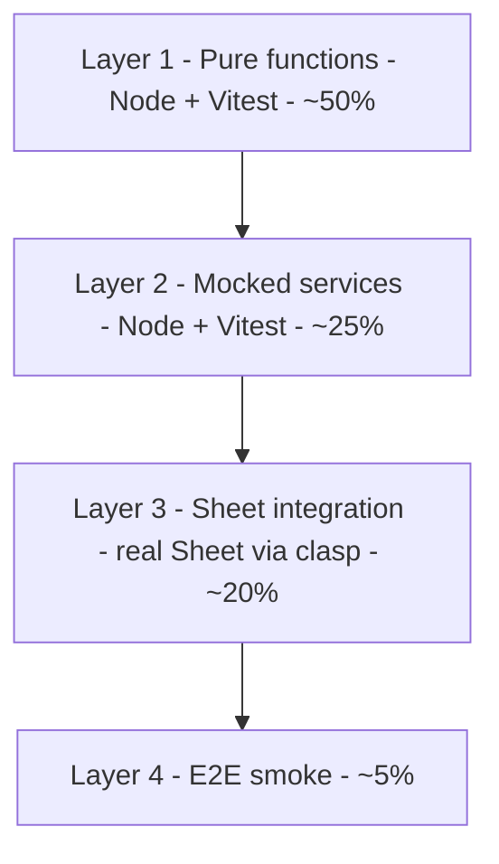

The bug that finally made me set up tests was a tax rounding error that quietly shipped wrong totals for two weeks. It lived in a plain function — no Sheets, no API — the kind of thing a single unit test would have caught in a second. But the project had zero tests, because the last person who tried had hit the wall everyone hits: `Jest can't load SpreadsheetApp`.

Apps Script *is* testable. You just can't test all of it the same way. Here's the four-layer approach I use, with the real code — and yes, I ran the examples in this post before publishing.

## Why Jest and Vitest choke on Apps Script

Apps Script runs on Google's servers with global services — `SpreadsheetApp`, `DriveApp`, `GmailApp`, `UrlFetchApp` — that simply don't exist in Node. Point Jest or Vitest at a file that calls `SpreadsheetApp.getActive()` and it throws `ReferenceError: SpreadsheetApp is not defined` before a single assertion runs. Coverage tools like Istanbul have the same problem. The script editor, meanwhile, has no test runner at all.

So you don't test Apps Script as one thing. You split it into layers by *what each layer needs to run*.

## The four-layer test pyramid



Most of the logic that actually breaks — date math, status transitions, dedupe, validation, tax calculation, AI prompt assembly — is pure. In real projects that's 50–60% of the code, and it runs in Node with no Apps Script at all. That's the layer you invest in first.

## Pattern 1: pure-function isolation

Keep the logic that doesn't touch a Google service in its own file, and make it importable in both runtimes with a `module.exports` guard.

```javascript
// pure/orderMath.js — works in both Node and Apps Script
function calculateOrderTotal(items, taxRate, discountCode) {
  const subtotal = items.reduce((s, i) => s + i.price * i.qty, 0);
  const discount = applyDiscount(subtotal, discountCode);
  const taxable = subtotal - discount;
  return {
    subtotal,
    discount,
    tax: round2(taxable * taxRate),
    total: round2(taxable + taxable * taxRate)
  };
}

function applyDiscount(amount, code) {
  if (code === 'WELCOME10') return amount * 0.1;
  if (code === 'VIP25')     return amount * 0.25;
  return 0;
}

function round2(n) { return Math.round(n * 100) / 100; }

if (typeof module !== 'undefined') {
  module.exports = { calculateOrderTotal, applyDiscount, round2 };
}
```

Now it's a normal Vitest test:

```javascript
// pure/orderMath.test.js
import { describe, it, expect } from 'vitest';
const { calculateOrderTotal } = require('./orderMath.js');

describe('calculateOrderTotal', () => {
  const items = [{ price: 10, qty: 2 }, { price: 5, qty: 1 }];

  it('applies VIP25 discount before tax', () => {
    const r = calculateOrderTotal(items, 0.18, 'VIP25');
    expect(r.subtotal).toBe(25);
    expect(r.discount).toBe(6.25);
    expect(r.total).toBe(22.13);
  });

  it('treats unknown codes as no discount', () => {
    const r = calculateOrderTotal(items, 0.18, 'BOGUS');
    expect(r.discount).toBe(0);
  });
});
```

That `22.13` is the case that would have caught my rounding bug: subtotal 25, minus a 6.25 VIP discount, plus 18% tax on the remaining 18.75, rounded to two places. The order-total function is the same shape as the one I use in a [WhatsApp storefront build](https://magesheet.com/blog/whatsapp-mini-storefront-google-sheets) — exactly the kind of money math you never want running untested.

## Pattern 2: mocking Apps Script services

Some functions have to touch a service. Don't hard-code `SpreadsheetApp` inside them — **pass it in**. Then in the test you hand over a fake and assert how it was called.

```javascript
// services/orderWriter.js
function writeOrderRow(sheetApp, sheetName, orderData) {
  const sheet = sheetApp.getActive().getSheetByName(sheetName);
  const row = [orderData.id, orderData.email, orderData.total, orderData.timestamp];
  sheet.appendRow(row);
  return row;
}
```

```javascript
import { vi, describe, it, expect } from 'vitest';

describe('writeOrderRow', () => {
  it('appends a row in the correct order', () => {
    const appendRow = vi.fn();
    const fakeSheet = { appendRow };
    const fakeSpreadsheet = { getSheetByName: vi.fn(() => fakeSheet) };
    const fakeApp = { getActive: vi.fn(() => fakeSpreadsheet) };

    const ts = new Date('2026-04-30T10:00:00Z');
    writeOrderRow(fakeApp, 'Orders', { id: 'O-1', email: 'a@b.com', total: 50, timestamp: ts });

    expect(fakeSpreadsheet.getSheetByName).toHaveBeenCalledWith('Orders');
    expect(appendRow).toHaveBeenCalledWith(['O-1', 'a@b.com', 50, ts]);
  });
});
```

The trick is dependency injection: the moment a function receives `sheetApp` as an argument instead of reaching for the global, it becomes testable in Node. This layer catches "wrote the columns in the wrong order" bugs, which are silent and miserable.

## Pattern 3: sheet-based integration tests

Some things you can only trust against a real sheet — a dedupe that depends on how Sheets actually stores values, for instance. These run *inside* Apps Script against a dedicated fixture spreadsheet, with tiny homegrown helpers.

```javascript
// integration/dedupe.test.gs
function test_dedupe_removes_exact_duplicates() {
  const ss = SpreadsheetApp.openById(TEST_FIXTURE_ID);
  resetSheet_(ss, 'Customers');
  seedFromFixture_(ss, 'Customers', '_TEST_FIXTURES');

  dedupeCustomers(ss.getSheetByName('Customers'));

  const rows = ss.getSheetByName('Customers').getDataRange().getValues();
  assertEquals_(rows.length, 4); // 5 seeded, 1 dupe removed
  assertEquals_(rows[1][1], 'alice@example.com');
}

function resetSheet_(ss, name) {
  const sheet = ss.getSheetByName(name);
  if (sheet.getLastRow() > 1) {
    sheet.getRange(2, 1, sheet.getLastRow() - 1, sheet.getLastColumn()).clearContent();
  }
}

function assertEquals_(actual, expected) {
  if (actual !== expected) {
    throw new Error(`Expected ${expected}, got ${actual}`);
  }
}
```

Always reset and re-seed from a fixture at the start of each test — never trust the sheet's leftover state from the last run.

## Pattern 4: clasp-driven CI

To run all of it on every push, you need the pure/mock tests in Node *and* the integration tests in Apps Script. [clasp](https://github.com/google/clasp) pushes your code to a dev script; GitHub Actions runs both halves and fails the build if either does.

```yaml
# .github/workflows/apps-script-tests.yml
on: [push]
jobs:
  test:
    runs-on: ubuntu-latest
    steps:
      - uses: actions/checkout@v4

      - name: Run pure unit tests
        run: npx vitest run

      - name: Auth clasp
        run: echo "${{ secrets.CLASPRC }}" > ~/.clasprc.json

      - name: Push to dev script
        run: npx clasp push --force

      - name: Run integration tests in Apps Script
        run: |
          npx clasp run runAllTests | tee out.log
          grep -q '"FAIL": 0' out.log
```

That last `grep` is the part people forget: `clasp run` can succeed as a command while your tests report failures in their output. Grepping for `"FAIL": 0` is what actually makes the CI job go red when a test breaks.

## Pitfalls that quietly kill an Apps Script test suite

*   **Reaching for the global inside the function.** If a function calls `SpreadsheetApp` directly, you can't test it in Node. Inject the service.
    
*   **Trusting** `clasp run`**'s exit code.** It exits 0 even when tests fail — assert on the output (the `grep` above), or a red suite looks green.
    
*   **Dirty fixtures.** Integration tests that don't reset the sheet pass or fail depending on the previous run. Reset and re-seed every time.
    
*   **Testing what won't break.** You don't need 90% coverage of glue code. Put the effort in the pure logic — that's where the money bugs live.
    
*   **Reaching for Jest coverage tools.** Istanbul/nyc assume a Node runtime; on the Apps Script side they don't apply. Measure coverage on the pure layer only.
    

## Wrap-up

You can't run all of Apps Script in Node — but you can run the half that actually breaks. Isolate pure logic and test it with Vitest, inject services so you can mock them, keep a thin layer of real-sheet integration tests, and wire clasp into CI so every push checks both worlds. The rounding bug that cost me two weeks would have died in a one-line assertion.

The production setup — a shared assertion library, fixture management, and a coverage gate — is written up on the [MageSheet blog](https://magesheet.com/blog/apps-script-unit-testing).

Built by the MageSheet team.

Apps Script *is* testable. You just can't test all of it the same way. Here's the four-layer approach I use, with the real code — and yes, I ran the examples in this post before publishing.

## Why Jest and Vitest choke on Apps Script

Apps Script runs on Google's servers with global services — `SpreadsheetApp`, `DriveApp`, `GmailApp`, `UrlFetchApp` — that simply don't exist in Node. Point Jest or Vitest at a file that calls `SpreadsheetApp.getActive()` and it throws `ReferenceError: SpreadsheetApp is not defined` before a single assertion runs. Coverage tools like Istanbul have the same problem. The script editor, meanwhile, has no test runner at all.

So you don't test Apps Script as one thing. You split it into layers by *what each layer needs to run*.

## The four-layer test pyramid


Most of the logic that actually breaks — date math, status transitions, dedupe, validation, tax calculation, AI prompt assembly — is pure. In real projects that's 50–60% of the code, and it runs in Node with no Apps Script at all. That's the layer you invest in first.

## Pattern 1: pure-function isolation

Keep the logic that doesn't touch a Google service in its own file, and make it importable in both runtimes with a `module.exports` guard.

```javascript
// pure/orderMath.js — works in both Node and Apps Script
function calculateOrderTotal(items, taxRate, discountCode) {
  const subtotal = items.reduce((s, i) => s + i.price * i.qty, 0);
  const discount = applyDiscount(subtotal, discountCode);
  const taxable = subtotal - discount;
  return {
    subtotal,
    discount,
    tax: round2(taxable * taxRate),
    total: round2(taxable + taxable * taxRate)
  };
}

function applyDiscount(amount, code) {
  if (code === 'WELCOME10') return amount * 0.1;
  if (code === 'VIP25')     return amount * 0.25;
  return 0;
}

function round2(n) { return Math.round(n * 100) / 100; }

if (typeof module !== 'undefined') {
  module.exports = { calculateOrderTotal, applyDiscount, round2 };
}
```

Now it's a normal Vitest test:

```javascript
// pure/orderMath.test.js
import { describe, it, expect } from 'vitest';
const { calculateOrderTotal } = require('./orderMath.js');

describe('calculateOrderTotal', () => {
  const items = [{ price: 10, qty: 2 }, { price: 5, qty: 1 }];

  it('applies VIP25 discount before tax', () => {
    const r = calculateOrderTotal(items, 0.18, 'VIP25');
    expect(r.subtotal).toBe(25);
    expect(r.discount).toBe(6.25);
    expect(r.total).toBe(22.13);
  });

  it('treats unknown codes as no discount', () => {
    const r = calculateOrderTotal(items, 0.18, 'BOGUS');
    expect(r.discount).toBe(0);
  });
});
```

That `22.13` is the case that would have caught my rounding bug: subtotal 25, minus a 6.25 VIP discount, plus 18% tax on the remaining 18.75, rounded to two places. The order-total function is the same shape as the one I use in a [WhatsApp storefront build](https://magesheet.com/blog/whatsapp-mini-storefront-google-sheets) — exactly the kind of money math you never want running untested.

## Pattern 2: mocking Apps Script services

Some functions have to touch a service. Don't hard-code `SpreadsheetApp` inside them — **pass it in**. Then in the test you hand over a fake and assert how it was called.

```javascript
// services/orderWriter.js
function writeOrderRow(sheetApp, sheetName, orderData) {
  const sheet = sheetApp.getActive().getSheetByName(sheetName);
  const row = [orderData.id, orderData.email, orderData.total, orderData.timestamp];
  sheet.appendRow(row);
  return row;
}
```

```javascript
import { vi, describe, it, expect } from 'vitest';

describe('writeOrderRow', () => {
  it('appends a row in the correct order', () => {
    const appendRow = vi.fn();
    const fakeSheet = { appendRow };
    const fakeSpreadsheet = { getSheetByName: vi.fn(() => fakeSheet) };
    const fakeApp = { getActive: vi.fn(() => fakeSpreadsheet) };

    const ts = new Date('2026-04-30T10:00:00Z');
    writeOrderRow(fakeApp, 'Orders', { id: 'O-1', email: 'a@b.com', total: 50, timestamp: ts });

    expect(fakeSpreadsheet.getSheetByName).toHaveBeenCalledWith('Orders');
    expect(appendRow).toHaveBeenCalledWith(['O-1', 'a@b.com', 50, ts]);
  });
});
```

The trick is dependency injection: the moment a function receives `sheetApp` as an argument instead of reaching for the global, it becomes testable in Node. This layer catches "wrote the columns in the wrong order" bugs, which are silent and miserable.

## Pattern 3: sheet-based integration tests

Some things you can only trust against a real sheet — a dedupe that depends on how Sheets actually stores values, for instance. These run *inside* Apps Script against a dedicated fixture spreadsheet, with tiny homegrown helpers.

```javascript
// integration/dedupe.test.gs
function test_dedupe_removes_exact_duplicates() {
  const ss = SpreadsheetApp.openById(TEST_FIXTURE_ID);
  resetSheet_(ss, 'Customers');
  seedFromFixture_(ss, 'Customers', '_TEST_FIXTURES');

  dedupeCustomers(ss.getSheetByName('Customers'));

  const rows = ss.getSheetByName('Customers').getDataRange().getValues();
  assertEquals_(rows.length, 4); // 5 seeded, 1 dupe removed
  assertEquals_(rows[1][1], 'alice@example.com');
}

function resetSheet_(ss, name) {
  const sheet = ss.getSheetByName(name);
  if (sheet.getLastRow() > 1) {
    sheet.getRange(2, 1, sheet.getLastRow() - 1, sheet.getLastColumn()).clearContent();
  }
}

function assertEquals_(actual, expected) {
  if (actual !== expected) {
    throw new Error(`Expected ${expected}, got ${actual}`);
  }
}
```

Always reset and re-seed from a fixture at the start of each test — never trust the sheet's leftover state from the last run.

## Pattern 4: clasp-driven CI

To run all of it on every push, you need the pure/mock tests in Node *and* the integration tests in Apps Script. [clasp](https://github.com/google/clasp) pushes your code to a dev script; GitHub Actions runs both halves and fails the build if either does.

```yaml
# .github/workflows/apps-script-tests.yml
on: [push]
jobs:
  test:
    runs-on: ubuntu-latest
    steps:
      - uses: actions/checkout@v4

      - name: Run pure unit tests
        run: npx vitest run

      - name: Auth clasp
        run: echo "${{ secrets.CLASPRC }}" > ~/.clasprc.json

      - name: Push to dev script
        run: npx clasp push --force

      - name: Run integration tests in Apps Script
        run: |
          npx clasp run runAllTests | tee out.log
          grep -q '"FAIL": 0' out.log
```

That last `grep` is the part people forget: `clasp run` can succeed as a command while your tests report failures in their output. Grepping for `"FAIL": 0` is what actually makes the CI job go red when a test breaks.

## Pitfalls that quietly kill an Apps Script test suite

*   **Reaching for the global inside the function.** If a function calls `SpreadsheetApp` directly, you can't test it in Node. Inject the service.
    
*   **Trusting** `clasp run`**'s exit code.** It exits 0 even when tests fail — assert on the output (the `grep` above), or a red suite looks green.
    
*   **Dirty fixtures.** Integration tests that don't reset the sheet pass or fail depending on the previous run. Reset and re-seed every time.
    
*   **Testing what won't break.** You don't need 90% coverage of glue code. Put the effort in the pure logic — that's where the money bugs live.
    
*   **Reaching for Jest coverage tools.** Istanbul/nyc assume a Node runtime; on the Apps Script side they don't apply. Measure coverage on the pure layer only.
    

## Wrap-up

You can't run all of Apps Script in Node — but you can run the half that actually breaks. Isolate pure logic and test it with Vitest, inject services so you can mock them, keep a thin layer of real-sheet integration tests, and wire clasp into CI so every push checks both worlds. The rounding bug that cost me two weeks would have died in a one-line assertion.

The production setup — a shared assertion library, fixture management, and a coverage gate — is written up on the [MageSheet blog](https://magesheet.com/blog/apps-script-unit-testing).

Built by the MageSheet team.